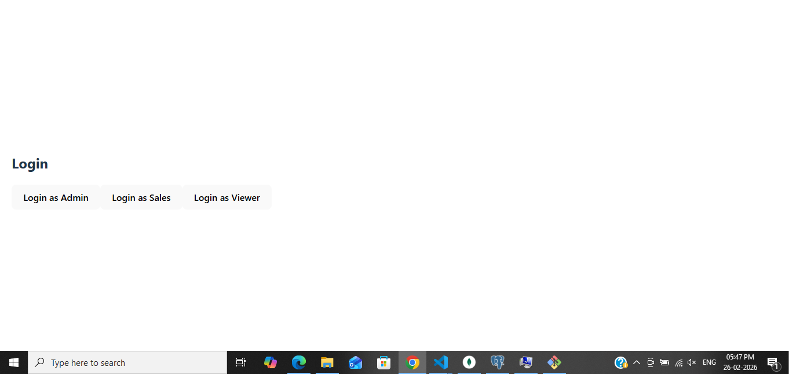

# crm-system
Enterprise CRM project using React and Node.js
## Features
- Lead Management
- Dashboard Analytics
- Role-Based Access Control
- Data Visualization

## Tech Stack
- Frontend: React.js
- Backend: Node.js, Express.js
- Database: MongoDB

## Screenshots

